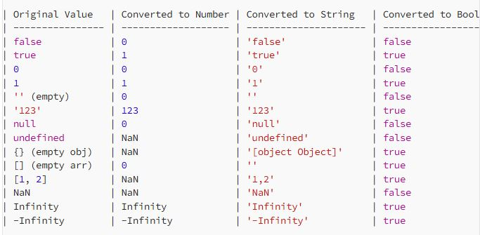

# Master in JAVA Script 
## 1. Introduction to JS 
JAVA script has invented by Brendan Eich in 1995 after it was standared by ECMA in 1997

**ECMA** :- European Computer Manufactures Association  
**ES8** :- Current version of ES  
**V8 Engine** :- JS Engine in Chrome browser  
Firefox JS Engine :- Spider Monkey

**NodeJS** :- Ryan Dahl:- Provided environment to execute JS code 

<mark>JS is Compiled and Interpreted Language   
Initally it was interpreted language</mark>

console :- 
Alternate name is REPL

**REPL**:- Read Evaluate Print Loop  

**Display**:-   
console.log("Message/value to display")    
<mark>In browser why the undefined is coming after console.log rendering.</mark>  

**Shortcut Key**:- 

  | Keys | Action |
  | -----| ------ |
  | ctrl+l | shortcute for erase |
  | ctrl+/ | comments |
  | ctrl+shift+p| open command palllate |
  | shift+alt+A | comment for multiple lines|
  | shift+alt+F | allign or format the code properly|
  | ctrl +s | open all function and property list |
  | ctrl + D | select one more repeated part |

  
## Extensions to Download
  | Extension | Purpose |
  | -----     | ------ |
  | JS ES6 | JS Code Snippet |
  | Code Spell Checker| Spell Checking|
  | Prettier | For code Formatter |

## 2. Data Types in JS
  Different Data Types in JS     

    A) Primitive Data Types 
       -Numbers (Refer 1_example.js)
       -String  (Refer 1_example.js)
       -Bigint
       -undefined (Refer 2_undefined_null.js)
       -null (Refer 2_undefined_null.js)
       -boolean (Refer 1_example.js)
       -symbol

    B) Non Primitive Data Types
       - array
       - object   
### Truthy and Falsy Value 
  (Refer 3_truthy_falsy.js)  
which are the data types are false and truthy value in JS  
   -> Truthy value is a value that is considered true when encountered in a Boolean context  
   -> All values are truthy unless they are defined as falsy.   
   -> That is, all values are truthy except false, 0, -0, 0n, "", null, undefined, NaN, and document.all.

### Data Type Conversion 
> ##### Conversion to number  
> 1. String => number/NaN   
> 2. null=> 0  
> 3. boolean=>1/0

> ##### Conversion to boolean
>  1. number=>boolean true/false
>  2. string=>boolean true/false
>  3. undefined=>false
>  4. null=>false

> ##### Convert to String
> 1. number=>String
> 2. boolean=>String
> 3. null=> String
> 4. undefined=>String

### Mathematical Operation on String Data (as a number)
> #### If string is a number then only these operation are executed
>   string +string=>string  
>   string -string=>number  
>   string *string=>number   
>   string /string=>number  


### Interview Questions belongs to Data Types
 1) what are the different data types in JS 
 2) what is the data type of NaN 
 3) what is the difference between Nan and null and undefined  
 4) what is difference between function calling using functionname() and console.log(functionname())   
 5) what is the data type of null
 6) Is null has a memory allocation?
 7) when NaN is used?
 8) 

## <mark>3. Variable Decleration</mark> 
#### There are three ways to declare the variable in JS  
  1. <mark>**var** (Refer 3_Variable_Decl)</mark>    
    -> var is global scope and functional scope  
    -> we can access var variable before decleration and initalization due to hoisting  
    -> we can reinitialize var variable in same scope  
    -> we can redeclare the var variable with same name in same scope     
  <mark>2. **let**</mark>   
    -> let has block scope   
    -> block scope varible can not access before decleration due  to TDZ  
    -> it can reinitialize in the same scope   
    -> but we can not redeclare in the same scope with same name  
  3. **const**  
    -> same as let variable   
    -> but only difference is we can not reinitalize or change the value of const variable  

#### Questions
Questions Related with the scoping:-
1) what is scope of let, var and const variable
2) can we redeclare and re initialize the let,var and const type of variable
3) How JS program work internally?
4) what is lexical scoping?
5) what is hoisting?
6) what is temporal dead zone?
7) what is auto global of variable?
8) How to avoid auto global process?
9) what is stack ?
10) what is call stack?
11) what is execution context?
12) what is global execution context?

## <mark>4. Function </mark> 
#### <mark>1. what is the function?</mark>
  -> Function :- performing the perticular task or operation and we can call multiple time without 
    writing reapeadly

#### 2. what is the syntax of function // way to define function in JS 
  -> There are different way to define function in JS  

    1. Function Decleration/ function Definition / Function Constant   
       Syntax:- function functionname(parameter name)
       {
          function definition
       } 
        calling :- function name()
     
    2. Function expression 
      Syntax :- 
      let variablename= function functionname()
      {
          function defintion 
      }
      calling:- variablename()

    3. Anonymous Function:- those function has does not have any name 
        Syntax:
        let variabel name=function()
        {
            function definition 
        }
        calling variablename()
    
    4. IIFL :- Immediately Invoked Function Expression Function executes immediately after its decleration and used anonymous property
        syntax :- 
            (function () {
                console.log("Welcome to Javascript");
                })();
    5. Arrow Function 
        Syntax :- 
        let variable name=(arument list)=>{
            function definition }
        }
    6. Constructor Function 
        The concept of a function constructor is to create a function object which executes in the global scope.   
        It can be used to create multiple objects that are similar.   
        The function constructor has similar functionalities as the function expression.  
        A constructor function is called with the new keyword to create an object. 
        The Function( ) is the constructor which houses the arguments:  
          example1
            var F = new Function(arg1, functionBody)
            var F = new Function(arg1, arg2, functionBody)
            var F = new Function(arg1, arg2, .........., argN, functionBody)

          example 2
            / new Function creates a new function object 'multiply'
            const multiply = new Function('a', 'b', 'return a * b');

            console.log(multiply(2, 6));
            // expected output: 12

          example 3
            // constructor function
            function Person() {
                this.name = "Anita",
                this.age = 21
            }
            // create an object
            const person = new Person();

            //access properties
            console.log(person.name);
            console.log(person.age);

#### 3. Rest Operator   
  Function with rest operator   
     -> If function dont know how many parameter they have to take then they used rest operator or we dont know exactly how many argument will be passing to the function definition in the function     
    -> Definition we used the rest operator.  
       Syntax :- ...variable name 

#### 4. Object and array as an argument
  -> We can pass the object and array as an argument to the function (Refer 4_example.js)

#### 5. Higher Order and Call back function 
  -> A function that returns a function or 
     takes other functions as arguments is called a higher-order function. 
     every, map, filter, setTimeout these are the higher order function 
   -> Function that pass to function as a argument then it is  called as call back function 

#### Interview Question on Function  
  1. what is the function? 
  2. How to define the function in JS? which are the diff way?
  3. what is the rest operator ...variable name
  4. Can we pass object and array as an argument for the function?
  5. what is higher order function?
  6. what is call back function?
  7. what is first order function?
  8. what is arrow function in JS?
  9. Can we call call back function recursively?
  10. Can we used higher order function as a call back function?
  11. Can we call arrow function recursively?(Refer 4_Function_JS-> 5_example)
  12. How to create function using constructor? 
  13. How to create object using constructor function?
  14. what are the way to call function in JS? (Refer 9_example.js)
  15. what is an execution context?
  16. what is call stack ?
  17. what is this keyword? what is the value hold by this keyword? (Refer 5_this_keyword->1_example.js)
  18. which are the different type of scope in JS explain with example.
  19. what is lexical scope in the program? Explain with example(5_this_keyword->2_example.js)
  20. what is the value of this in arrow function with different senario? (Refer 3_example.js)
  21. Solve some coding questions on this (Refer 4_Q_A.js)

## 5&6. Execution Context and Scope 
#### Execute JS Code Internally 
  -> JS Code execute internally in two phases called as memory creation phase and code execution phase.   
  -> In memory creation phase JS engine just allocates the memory for the variable and function but do not assign any value to the variable   
  -> In code execution phase JS engine assign the value to the variable and execute the function   
  -> That process we called as execution context   
  -> Same procedure will be followed for the every function which is mentioned in the source code   
#### **Debugger** 
  -> By using debugger we can debug the code line by line and observed the output of each line  
  -> Defer :- The defer attribute in HTML is used with script elements to control the execution timing of an external JavaScript file. It ensures the script is executed after the HTML document has been fully parsed.
  -> The defer attribute is a great way to optimize the loading and execution of external JavaScript files, ensuring smoother page rendering and better user experience. It’s especially useful for scripts that manipulate or interact with the DOM.

### What is Execution Context:- 
  It is environment in which JS code is executed, including variable scope and function declaration 

### What is call stack :- 
    It is mechanism for managing the order of function calls and their execution contexts 

    If recursively we called function continuously, so after some time call stack goes to overflow, that concept we called as stack overflow

### Doest hoisting is apply to function declaration as well as function expression.
-> For function expression, hoisting does not applicable, it shows an error 

## Scope 
 1. Global Scope:-   
  -> when we start the execution then its goes to globl scope   
  ->global scope divided into two category:- window object(global) + script scope  
  ->window object :- it has variable with declaration of var   
  ->script scope:- variables with declaration of let and const   
  -> global variables access any where in the program bcoz its scope is global

 2. Local Scope:-
   -> local scope access within the block of code
   -> variable declare in the particular block of code 

### <mark>Example to understand the scope concept</mark>
 

### Lexical Scoping:- 
When a function is created inside another function, the inner function can access variables from the outer function's scope (and even further out to the global scope).
```
    function outerFunction() {
      const outerVariable = "Hello";

      function innerFunction() {
        console.log(outerVariable); // Accessing outerVariable from innerFunction
      }

      innerFunction();
    }

    outerFunction();
```
### Closure:-  
In JavaScript, a closure is formed when a function is defined inside another function, allowing the inner function to access variables and parameters from the outer function's scope, even after the outer function has finished executing. 

```
 function outerFunction() {
  let outerVariable = "I am from the outer function";

  function innerFunction() {
    console.log(outerVariable); // Inner function accessing the outerVariable
  }

  return innerFunction;
}

let closureExample = outerFunction(); // Outer function called and returned, and the result assigned to closureExample
closureExample(); // Inner function invoked, which still has access to outerVariable even though outerFunction has finished executing.
```

### Higher Order and Call back function 
  -> A function that returns a function or 
     takes other functions as arguments is called a higher-order function. 
     every, map, filter, setTimeout these are the higher order function   
   -> Function that pass to function as a argument then it is  called as call back function 
   ```
   
//Higher Order Function 
function higherOrder(parameter)
{
    console.log(typeof parameter)
    console.dir(parameter);
    parameter()
}

//Call back function 
// function test()
// {
//     console.log("I am call back function")
// }
// higherOrder(test)

higherOrder(
    function()
    {
        console.log("I am call back function")
    }
)
   ```

#### Interview Question 
  1. what is the execution context ? 
  2. what is hoisting? 
  3. what is temporal dead zone? 
  4. How to debug JS code (in browser as well as vs code)
  5. what is break point ? 
  6. what is the use of debugger keyword in code? 
  7. what is the use of defer attribute ? 
  8. what is call stack?
  9. what is stackoverflow?
  10. what is closure in JS?
  11. what is lexical scoping?
  12. What is higher order function?
  13. What is call back function?
  14. what is synchronous programming, explain with example?
  15. what is asynchronous programming?
  16. How to achieve asynchronous programming in JS? 
  17. what is setTimeout and setInterval function in JS?
  18. what is clearTimeout and clearInterval function in JS? 
  19. what is event loop?
  20. what is callback queue in JS? 
  21. 
  

## 7. Dialog Box in JAVA Script    
(Refer 7_Dialog_Box)
##### There are three type of dialog box in JS  
  1. alert(message) 
  2. confirm(message)
  3. prompt(message)

## 8. String (Refer 8_String->1_example.js)
##### ***String Creation and its functions*** 
   ***String*** :- In JS string an one of the data type   
   ***Creation of String***:- 
   ***Syntax:-*** variable declaration variable name="String" 
   e.g. let city_name='Pune' 

   ***Property:-*** Every string has length which is find out by length property 
     city_name.length

  ***Function belong to String :-*** 

  **Methods (without arguments)**   
    **1. toUpperCase():-** to convert in uppercase   
    **2. toLowerCase():-** to convert in lowercase   
    **3. trim():-** to remove starting and ending white space   
    **4. trimEnd()-** remove only ending white space   
    **5. trimStart()-**remove only starting white space   
  But in these functions original string will not be changed   

  **Methods (with arguments):-**   
    **1. includes("string value")**=>check the argument value is present or not (result true /false). It is case sensitive (Refer 1_example.js)  
    **2. indexOf('character')**=> its return the first index of given argument character from the input string. Shows -1 when char is not present. Also find out the index of any substring  
    **3. replace()**=>its replace the first occurrence of char or string from the input     
    **4. replaceAll()**=>replace all occurrence of mentioned argument char and string     
    **Replace function  does not change the original string**   
    **5. concat(str1,str2)**=>concat multiple string with original string   
    **6. padEnd/padStart(output string length, "padding char")**=> return string with padding char either beginning or ending its depends on function   
    **7. charAt(index)**=>find out the char at that index   
    **8. charCodeAt(index)**=>Return the unique no of particular char at that index   
    **9. split(" ")**=> Split a string into substrings using the specified separator and return them as an array.  
    **10. slice(start,end)**=> Returns a section of a string.  
        start — The index to the beginning of the specified portion of stringObj.  
        end -The index to the end of the specified portion of stringObj. The substring includes the characters up to, but not including, the character indicated by end. If this value is not specified, the substring continues to the end of stringObj.
  
  ```
  let str="JavaScript"

  console.log(str.slice(4, 10)); // "Script"
  console.log(str.slice(4, -1)); // "Scrip"
  console.log(str.slice(-6, -1)); // "Scrip"
  console.log(str.slice(7, 4)); // "" (Invalid range)

  console.log(str)//JavaScript

  console.log(str.substring(4, 10)); // "Script"
  console.log(str.substring(4, -1)); // "Java" (Negative treated as 0)and swap the indices
  console.log(str.substring(7, 4)); // "Scr" (Swaps indices)
  console.log(str.substring(7, 7)); // "" (Empty range)

  /* 
  slice()
  -> Supported; counts from the end of the string.
  ->Does not swap indices; invalid range returns an empty string.
  ->Does not modify the original string.

  substring()=>
  -> Not supported; negative values treated as 0.
  -> Automatically swaps indices if startIndex > endIndex.
  -> Does not modify the original string.
  */
  ```
##### **Interview Questions**
 1. what is string in JS? 
 2. How to create or declare the sting in JS?
 3. what are the properties and function related to the string ?
 4. what is the difference between split and splice function ?

## <mark>9. Operators</mark> 
   Operators means perform the operation on two operands 
### **1. Different type of operators** 
**A. Arithmetic Operator (+ - * / % ** )**   

**Math**:- By using Math object we can solve any type of mathematical operation 
As well as its provide the some Math properties

**Math Property:-** pi, E, log2  
**Math Function:-**
 1. Math.pow(first, end)=>exponential value
 2. Math.sqrt(number)=>sqrt of number
 3. Math.floor()=> Returns the greatest integer less than or equal to its numeric argument
 4. Math.ceil()=>Returns the smallest integer greater than or equal to its numeric argument
 5. Math.round()=> Returns a supplied numeric expression rounded to the nearest integer.
 6. Math.random()=> Generate random number (0 to 1)

##### **Interview Question 
 1. what is the use of Math object?
 2. what are the functions in Math object and there use, explain with example?
 3. How to generate any random number in particular range
 4. what is type conversion and type coercion and their diff? 
 5. what is truthy and falsy value? 

 **B. Compare Operator**  
 **1. Equality Operator (==) (Equal to)=>** It converts the value implicitly   
 **2. Strict Equality Operator(===)=>** It does not convert the value in different data type       
  =>Its check data type as well as value of the variable   
 **3. Not Equal Operator (!=) =>** It converts data type implicitly  
 **4. Strict Not Equal (!==)=>** It check data type as well as value   
 **5. Greater than (>) and Greater than equal(>=)=>** Its check greater than or not   
 **6. Less than (<) Less than equal (<=)=>** It check first no is less with second number or not
###### **Interview Questions**
1. what is compare operator?
2. what are compare operators in JS?
3. what is the difference between equality and strict equality operator?
4. Explain the use of != and !== 

**C. Logical Operator**   

**1. Logical And/OR operator (&&/||)**
  -> It perform logical and/or  operation between two relational expression
  -> Also it perform the logical operation on truthy and falsy value
**2. Logical Bitwise Operator (&/|)**
   -> Logical operation on bit level 
**3. Not Operator (!)**
 -> Change the boolean status of the value 
###### **Interview Question**
 1. what are the logical operators in JS?
 2. what is logical operator and there used?
 3. Example of logical operators?

Conversion of Different Value in Different Data Type


**Difference between Data Coversion and Data Conversion  
-> Type Coercion (Implicit Conversion)  
Done automatically by JavaScript when an operation involves different types.
JavaScript converts types implicitly depending on the operation.  
Example:-
```
console.log("5" - 2); // 3 (String "5" is coerced to a number)
console.log("5" + 2); // "52" (Number 2 is coerced to a string)
console.log(true + 1); // 2 (true is coerced to 1)
```

Type Conversion (Explicit Conversion)
Done manually using functions like Number(), String(), or Boolean().
You have control over how the value is converted.
Example:-
```
 let str = "123";
  let num = Number(str); // Explicit conversion from string to number
  console.log(num, typeof num); // Output: 123 'number'
```
## 10. Statements 
##### **A. Condition Statement (Refer 10_Condition_Stat)** 
  1. If Statement
  2. If Else Statement 
  3. IF else if statement 
  4. Nested If else statement 
  5. switch case statement:- In switch case statement, choice value always check on strictly equality basis with label
  6. Ternary Operator :- 

##### Interview Question 
 1. What is the fundamental difference between ternary operator and if else statements?
  Summary Table
**Feature	Ternary Operator**	
Syntax	condition ? expr_if_true : expr_if_false	
Primary Use	Single value assignment/evaluation.	
Readability	Concise for simple cases.
Output	Returns a value.
Side Effects	Not ideal for side effects.
**If-Else Statement**
Syntax Multi-line with if, else blocks.
Primary Use Complex logic and multiple actions.
Readability Clear for complex conditions.
Output Executes a block of statements.
 Side Effects	Can handle side effects.
 2. Can you explain why expressions can appear within statements but statements cannot appear within expressions in JavaScript? (refer 10_diff_exp_stat.js)

## 11. Variable Address 

 ##### Interview Question 
 1. How to find out the variable memory location in JS ?
 2. What happen in JS code execution ?  
 3. Which are the data types their memory address is fixed?

## 12. Non Primitive Data Types 

**In JAVA script there are seven primitive data types but <mark>non primitive is only one and that is nothing but the object.<mark>**
 
 Objects are further divided into three category 
 1. object literals
 2. arrays
 3. functions 

 ##### 1. Objects Literals (Refer 12_NonPrimitive_DT Folder)
 Object consist of key values pair to hold multiple elements of different data types.

 Example 
 ``` 
 const obj1={
  emp_name:'Nilesh Shirude',
    role:'Assistant Professor',
    dept:'E&TC',
    joining_date:'4th Sept 2014',
    year_exp:10,
    email_id:'nsshirude@pict.edu',
    mob_no:8956210124,
    skill:'JAVA, JS, OOP Programming, DSA'
 }
 console.log(obj1)
 ```

<mark>If two objects are hold similar elements still they are not equal because objects are compare with their address or references.<mark>

We can access the object element by . notation or [] bracket notation. 
We can also add the element into object 
```
  obj1.address='Mohan Nagar'
  console.log(obj1) //object will be update by address
 ```

**Note:- <mark>When we declare object with const variable then we can add or delete the element inside the object variable without changes in its address**<mark>

Example 
```
const obj1={
    emp_name:'Nilesh Shirude',
    role:'Assistant Professor',
    dept:'E&TC',
    joining_date:'4th Sept 2014',
    year_exp:10,
    email_id:'nsshirude@pict.edu',
    "mob-no":8956210124,
    skill:'JAVA, JS, OOP Programming, DSA'

}
console.log(obj1)
//obj1.edu='MTech'
//console.log(obj1)
```
Here address of obj1 its does not change even we can add the new element edu. 
 
**Object freeze() and seal() function :-**  
 **a) Object.freeze(object name):-** Due to freeze we can not update the object element as well as we can not add or delete any object element 

 **b) Object.seal(object name):-** Due to seal we can just modify the existing element value but we can not add or delete any element from the object using seal method

**How t make a dupliate object**
```
  let obj={
    first_Name:"Nilesh",
    lastname:"Shirude",
  }
let obj1=obj
console.log(obj)
console.log(obj1)
  let fruits=["Watermelon","muskmelon"]
  let myfruits=fruits
  fruits.push("apple")
  console.log(fruits)
  console.log(myfruits)
  //Here both object are pointed to same address
```

```
  // But we have to make duplicate copy with different address 
  //so its create by Object.assign() method
  let obj2={}
  Object.assign(obj2,obj1)
  //Suppose we updated in obj2 then obj1 will not be reflected
  obj2.lastname="Patil"
```

```
  //But Object.assign(obj,obj) is old technique
  //Now day we follow the another process -> By using spread operator 
  //Syntax :- let object name={...existing object}
    let obj3={...obj}
    obj3.first_Name="Kiran"
    console.log(obj)
    console.log(obj3)
  //It is same for array also 
```

```
  //Example of shallow copy object within object has same address even after the shallow copy using spread operator
    let obj1={
    firstname:"Nilesh",
    lastname:"Shirude",
    address:{
        city:"Pune",
        pincode:411045
      }
    }
  let obj2={...obj1}
  console.log(obj1)
  console.log(obj2)
  obj2.firstname="Suraj"
  obj2.address.city="Nashik"
```
***Deep Copy Example***
1) Deep copy acheieved through JSON function 
  ```
  const new_object= JSON.parse(JSON.stringfy(object))
  ```
2) By using strcturedClone() method      
 ```
   const user2=structuredClone(user1)  
 ```

 ```
   //Example
   const user1={
    name:"coder",
    hobbies:["Programming","Badminton","Songs"]
    }
    const user2=structuredClone(user1)
    //const user2=JSON.parse(JSON.stringify(user1))
    user2.hobbies.push("cricket")


    console.log(user1)//{ name: 'coder', hobbies: [ 'Programming', 'Badminton', 'Songs' ] }
    console.log(user2)
    /* Output :- 
      {
        name: 'coder',
        hobbies: [ 'Programming', 'Badminton', 'Songs', 'cricket' ]
      } */
```

 ##### Interview Question 
 1. what is object in JS?
 2. How to create an object in JS? 
 3. How to update any element from the object?
 4. How to add and remove any element in the object?
 5. How to make object element mutable? 
 6. what is the use of freeze and seal function of object?
 7. How to check any key is present in the object? (Refer 3_Object_ele_add_del.js)
 8. How to make duplicate or reference object?
 9. What happened when we copy the array or object using spread operator?
 10. What is the use of Object.assign() function?
 11. what is the difference between shallow copy and deep copy of object?
 12. what are the different way to take deep copy of the object?
 

## 13. Array (Non Primitive Data Type)
   #### **A. Definition**:-  
    -> Array is In JS array is a data strcture to store the heterogenous data at index based  
    -> Syntax :- variable decleration [array elements seperated by comma]  
    -> Array is one of the non primitve data type and its type its nothing but the object   
    -> Object have object literal, array, and function non primitive data type  

    >**when you find out the** 
    >>typeof(arrayname)=> object   
    >>typeof(object_literal)=>object 
    >>typeof(function_name)=>function 

  #### **B. Array Predefined Function**
  1) push():- Appends new elements to the end of an array, and returns the new length of the array.
  ```
     const arr=[23,12,34,55,23]
     console.log(arr)//[ 23, 12, 34, 55, 23 ]
     arr.push(67)
     console.log(arr)//[ 23, 12, 34, 55, 23, 67 ]
  ```
  2) pop() :- Removes the last element from an array and returns it. If the array is empty, undefined is returned and the array is not modified.
  ```
  arr.pop()
  console.log(arr) //[ 23, 12, 34, 55, 23 ]
  ```
  3) shift():- Removes the first element from an array and returns it. If the array is empty, undefined is returned and the array is not modified.
  ```
    arr.shift()
    console.log(arr)//[ 12, 34, 55, 23 ]
  ```
  4) unshift():- nserts new elements at the start of an array, and returns the new length of the array.
  ```
  arr.unshift(11)
  console.log(arr); //[ 11, 12, 34, 55, 23 ]
  ``` 

  5) concat():- Combines two or more arrays. This method returns a new array without modifying any existing arrays.
  ```
  const arr1=["Grapes","Watermelon","Maskmelon","watermelon"]
  console.log(arr.concat(arr1)); //[ 11, 12, 34, 55, 23, 'Grapes', 'Watermelon', 'Makmelon' ]
  console.log(arr)//[ 11, 12, 34, 55, 23 ] 
  ```

  6) indexOf():-Returns the index of the first occurrence of a value in an array, or -1 if it is not present.
  ```
  console.log(arr);//[ 11, 12, 34, 55, 23, 12 ]
  console.log("index of 12:-",arr.indexOf(12))//1 it shows the only index of occurence of first ele
  console.log("index of Watermelon:-",arr1.indexOf("Watermelon"));
  console.log("index of watermelon:-",arr1.indexOf("watermelon"));
  console.log("index of waterMelon:-",arr1.indexOf("waterMelon"));//it return -1 if the value does not present
  ```

  7) includes() :- Determines whether an array includes a certain element, returning true or false as appropriate.
  ```
    console.log("12 present in the array or not",arr.includes(12))//true show ele is present in the array
    console.log("waterMelon is present or not:-",arr1.includes("waterMelon"))
  ```

  8) reverse():-Reverses the elements in an array in place. This method mutates the array and returns a reference
  ```
  console.log(arr.reverse())
  console.log(arr);//original arry has changed after reverse operation on given array
  console.log(arr1.reverse())
  ```

  9) sort():- Sorts an array in place. This method mutates the array and returns a reference to the same array
  ```
  console.log(arr1.sort());//[ 'Grapes', 'Maskmelon', 'Watermelon', 'watermelon' ]
  console.log(arr1);//[ 'Grapes', 'Maskmelon', 'Watermelon', 'watermelon' ]
  console.log(arr.sort())//[ 11, 12, 12, 23, 34, 55 ]
  console.log(arr)//original array has changed after sorting [ 11, 12, 12, 23, 34, 55 ]

  const arr2=[18,11,13,16,15,26,22,21,8]
  console.log(arr2.sort());
  //they sort as per the series [11, 13, 15, 16, 18, 21, 22, 26,  8]
  //sort by UTF 16 code 
  ```

  10) Slice():- abstract some content of array or subarray end index value is excluded 
  ```
    console.log(arr.slice(2,4))//[ 12, 23 ]
    console.log(arr);//[ 11, 12, 12, 23, 34, 55 
    //In slice method original array is as it is there
  ```

  11) splice():-Removes elements from an array and, if necessary, inserts new elements in their place, returning the deleted elements.
  ```
    console.log(arr)//[ 11, 12, 12, 23, 34, 55 ]
    console.log(arr.splice(2,1,89))//[ 12 ]
    console.log(arr)//[ 11, 12, 89, 23, 34, 55 ]
  ```

  ```
    //JS Code to find out of index of multiple occurence of same element 
    //JS there is no such method directly to find out indices of multiple occuence of same element by we can find out by some logic and foreach function 
    const arr=[10,12,34,12,56]
    let target_value=12
    let occ=[]

    arr.forEach((ele,index)=>{
        if(ele===target_value)
            occ.push(index)
    })
    console.log(occ)
  ``` 

  ```
    let arr=[12,23,45,33,67,54,89,92]
    console.log(arr)
    /* [
        12, 23, 45, 33,
        67, 54, 89, 92
      ] */
    console.log(arr.slice(2,5))//[ 45, 33, 67 ]
    console.log(arr.slice(-2,-3))//[]invalid range, it work on -ve paramteres also,
    console.log(arr.slice(2,-3))//[ 45, 33, 67 ]
    console.log(arr.slice(-4,-2))//[ 67, 54 ]
    console.log(arr.slice(2,0))//[]invalid range, parameters values does not swap 
    //slice method works from left to right
    //And original array is still present as it is 
    console.log(arr);

    console.log(arr.splice(2,1))//[45]
    console.log(arr); //45 has remove from the array
    /* [
        12, 23, 33, 67,
        54, 89, 92
      ] */
    console.log(arr.splice(-4,-2))
    console.log(arr)
    console.log(arr.splice(-4,2))//[ 67, 54 ]
    console.log(arr);//[ 12, 23, 33, 89, 92 ]
    console.log(arr.splice(2,0))//[]

    console.log(arr)
```
## 17.Difference Between Function and Method 
 #### **Function and Method:-**(Refer 17_Fucntion_Method/example1.js)
 1. Functions are standalone blocks of code, while methods are functions defined inside objects.  

 2. Methods are functions defined inside objects, while functions are standalone blocks of code.

 3. What is the role of the return statement in both functions and methods in JavaScript?  
 -> It is used to return a value from the function or method back to the caller.

 4. Methods are invoked using dot notation, while functions are invoked using parentheses.

## 18.Arrow Function:-
 #### **Definition:-** (Refer 18_Arrow_Function/example1.js)
 Arrow function is one of the ananymous function expression type 

 ```
 //Syntax
 (parameter to pass)=>{
   // function statement
 } 
 ```
#### **Advantage of Arrow Function**
1. They automatically bind to the this value of the enclosing scope.
2. Arrow functions automatically inherit the this value of the enclosing lexical scope

## 19. Use of for of and for in (refer 19_for_of_for_in)
#### **for of:-**
The for...of statement executes a loop that operates on a sequence of values sourced from an iterable object. Iterable objects include instances of built-ins such as Array, String, TypedArray, Map, Set, NodeList

#### **for...in:-**
The for...in statement iterates over all enumerable string properties of an object (ignoring properties keyed by symbols), including inherited enumerable properties.

## **20. ForEach() method**

The forEach() method of Array instances executes a provided function once for each array element. 

Unlike map(), forEach() always returns undefined and is not chainable.

callbackFn
A function to execute for each element in the array. Its return value is discarded. The function is called with the following arguments:

element
The current element being processed in the array.

index
The index of the current element being processed in the array.

array
The array forEach() was called upon.

## 21. Map, Filter and Reduce Method

#### **1. map() method:-** 
The map() method of Array instances creates a new array populated with the results of calling a provided function on every element in the calling array.

Map method is capable to go to every element of the array and apply the call back function on each element and return the new resultant array 

map method does not change the existing original array
```
<!-- syntax :- array_name.map(()=>{
  //call back function logic
})
Example  -->
let months=["Jan",'Feb','Mar','June','Aug',"Oct",'Nov','Dec']

const month_data=months.map((month1,index,array)=>{
   // console.log(index,month1)
   //console.log(array)
   return (month1)
})
console.log(month_data)
```

#### **2. filter() method:-**
filter method is go to every element of array and apply the callback function with condition on each element of the array. And filter out the element only those who satisfied the condition 

Syntax:- 
array_name.filter((ele)=>{
  return condition 
})
Example:- 
```
let months=["Jan",'Feb','Mar','June','Aug',"Oct",'Nov','Dec']

const filter_data=months.filter((month)=>{
    //return month.length>3

    return month.toLowerCase().includes('a')
})
console.log(filter_data);
```
Output:- 
```
PS D:\Master_JS\21_map_filter_reduce> node map1.js
[ 'Jan', 'Mar', 'Aug' ]
```

     


